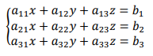

  

  

  

---

  <h1>

    
UNIVERSIDAD DE COSTA RICA

    
FACULTAD DE CIENCIAS

    
ESCUELA DE MATEMATICA

    
DEPARTAMENTO DE MATEMATICA APLICADA

  </h1>

  <h2>
    
MA-0292 Algebra Lineal para Computacion

    
II CICLO 2024

  </h2>

<h3> Trabajo Grupal (Investigacion - Programacion) </h3>

Este trabajo se podrá entregar y presentar en cualquier momento a partir de la cuarta semana de clases. La entrega y/o presentacion (en clase) del trabajo sera del 25 al 29 de noviembre (a mas tardar). El trabajo se realizara en grupos de 4 personas. Cada grupo debera diseñar un programa que responda a los siguientes lineamientos y requisitos:

<ul class = "arrow-bullet">
  <li>Programar en Java el juego titulado: <b>"DETERMINAR"</b>.</li>
  <li>El juego debe poder generar un sistema de lineales 3x3 (no homogeneo) de tal forma que tenga solucion unica.
   
  

    
  

   
  Ademas, debe permitir al usuario "actualizar/refrescar" el sistema para que genere uno nuevo cierta cantidad de veces (minimo 3). Es decir, los coeficientes numericos deben cambiar para crear un nuevo sistema, siempre con solucion unica. Sugerencia: utilizar coeficientes aleatorios entre -10 y 10.  
  </li>
  <li>Requisitos o reglas del juego:
    <ul class = "dot-bullet">
      <li>Se toma la matruz de alguno de los sistemas anteriores (se eligira por votacion de los jugadores)  y se le calcula el determinante. Este resultado debera aparecer a lo largo del juego.</li>
      <li>Se tendran tres jugadores. El juego constara de 5 rondas de un turno cada uno.</li>
      <li>El juego consiste en que cada jugador debe cambiar el valor de alguna de las entradas de la matriz para que el determinante cambie (cada cambio debe quedar registrado para el siguiente turno): 
        <ol class = "letter-bullet">
          <li>Los jugadores deberan ingresar la entrada/componente de la matriz que desean cambiar y el valor que le asignaran.</li>
          <li>Si el determinante no cambia o repite un valor anterior (distinto al original), el jugador respectivo pierde el turno siguiente (el programa debe indicarlo y saltarlo en el siguiente turno). Si el determinante obtenido en un turno es igual al original, entonces el jugador respectivo repite el turno (el programa debe indicarlo y permitirle repetir el turno).</li>
          <li>Cada jugador inicia con <b><i>Puntaje total: 0 puntos</i></b>. Este puntaje se ira modificando con el <b><i>Determinante de turno</i></b> obtenido por cada jugador respectivamente. Si el <i>determinante de turno</i> es positivo, entonces al <i>puntaje total</i> anterior se le suma el valor absoluto de la diferencia entre el determinante original y el determinante de turno. Si el <i>determinante de turno</i> es negativo, entonces al <i>puntaje total</i> anterior se le suma directamente el <i>determinante de turno</i>. Ejemplos: suponga que el determinante original (el de la matriz del sistema elegida) es 8, entonces: 
            <ol class = "roman-bullet">
              <li>Jugador A. Puntaje total = 0.
               
              Turno 1: determinante de turno = 6, entonces su Puntaje total = 0 + | 8 - 6 | = 2.
               
              Turno 2: determinante de turno = 15, entonces su Puntaje total = 2 + | 8 - 15 | = 9.
               
              Turno 3: determinante de turno = -10, entonces su Puntaje total = 9 + -10 = -1.</li>
            </ol>
          </li>
          <li><i>Ganador</i> sera el jugador quien tenga mas puntos (positivos) al final de la ultima ronda. Ahora, el primer jugador que alcance, en alguno de los turnos, el valor 21 en el determinante gana inmediatamente. Por otro lado, si todos los jugadores llegan al final con puntaje negativo, entonces nadie ganara y se llmara <i>perdedor</i> quien tenga menos puntos (mas puntos negativos). El programa debe indicar cual jugador gano/perdio y su puntaje respectivo. En caso de un empate: el <i>ganador</i> sera quien haya tenido el primer determinante de turno mayor; o el <i>perdedor</i> sera quien haya tenido el ultimo <>determinante de turno</i> menor.</li>
        </ol>
      </li>
      <li>En cada turno debe aparecer el puntaje acumulado de cada jugador y el numero de turno que se esta jugando.</li>
      <li>El programa debe permitir al usuario reiniciar el juego (cambiando el sistema y la matriz) o finalizarlo.</li>
    </ul>
  </li>
  <li>Los estudiantes tienen la libertad de agregar nuevas reglas, mas elementos, colores o cualquier otro aspecto que mejore, haga mas atractivo, divertido o interesante el programa/juego, siempre que se mantengan las anteriores.</li>
  <li>En todo caso, se debe mantener un lenguaje y expresiones de respeto (aunque se permite la comedia).</li>
</ul>

**NOTA:** sera parte del trabajo investigar cualquier aspecto necesario para cumplir con los requisitos establecidos. El trabajo tiene un valor de 5%.

**IMPORTANTE:** el programa no se puede hacer con Inteligencia Artificial (IA), segun los objetivos estipulados para el curso. La persona estudiante debe ser la responsable del desarrollo y adquisicion de su propio conocimiento, con todo lo que esto implica. Por tal razon, el profesorado de la catedra se reserva el derecho de verificar las respuestas y/o trabajos (parcial o totalmente) del alumnado (individual o grupal) mediante el mecanismo que considere oportuno o necesario (pregunta posterior a la entrega del trabajo, llamado oral durante alguna clase u hora consulta, revisar o verificar el codigo, entre otros) a fin de controlar que el trabajo fue realizado por los(as) estudiantes matriculados(as) en el curos. En caso de utilizar alguna IA, esto constituye un fraude, por lo que automaticamente se le asignara un cero en el trabajo correspondiente <u>a todo el grupo</u> y se aplicara la normativa respectiva. Por eso, en el trabajo grupal, cada integrante debe velar que su companeros(as) no incumplan esta indicacion, ya que la elaboracion del trabajo es responsabilidad de todos y de cada miembro del equipo. Se aclara que un trabajo grupal no consiste en dividar tareas, sino que en conjunto todos los miembros participen en cada proceso.

Ademas la presentacion de este proyecto tiene cierto porcentaje en su nota final, el cual se le asigna solo a las personas del grupo que participen en dicha presentacion. Si alguna persona del grupo falta, los demas deben realizar la presentacion en su completitud, de lo contrario todo el grupo tendra 0 puntos en la exposicion.

<b>Nota: al exponer este trabajo, cada grupo debe dar al profesor una hoja con la rubrica que se presenta en la siguiente pagina para ser calificados, en el cual deben aparecer los nombres y carne de cada integrante.</b>

<b>Sin esta rubrica no exponen, si no exponen obtienen cero en la nota.</b>

<h3> Rubrica para Evaluacion del Trabajo Grupal (total 15 puntos) </h3>

<b>Nombres y Carne:</b> 
______________________________________________________________ 
______________________________________________________________ 
______________________________________________________________ 
______________________________________________________________

Si el grupo no presentó trabajo, si lo que presento es totalmente diferente a lo solicitado o el programa no compila, entonces tendra un cero en la calificacion. Si el programa compila, entonces se utilizara la siguiente rubrica.

|            Criterio            |                                                           Malo (0)                                                           |                                                               Regular (1)                                                                |                                                                                               Bueno (2)                                                                                               |                                                             Muy Bueno (3)                                                              |
| :----------------------------: | :--------------------------------------------------------------------------------------------------------------------------: | :--------------------------------------------------------------------------------------------------------------------------------------: | :---------------------------------------------------------------------------------------------------------------------------------------------------------------------------------------------------: | :------------------------------------------------------------------------------------------------------------------------------------: |
| **Cumplimiento de Requisitos** |                              El trabajo no cumple con ninguno de los requisitos especificados.                               |                                   El trabajo no cumple con la mayoria de los requisitos especificados.                                   |                                                             El trabajo cumple con la mitad o la mayoria de los requisitos especificados.                                                              |                                       El trabajo cumple con todos los requisitos especificados.                                        |
|       **Funcionalidad**        |                                               El juego falla en su totalidad.                                                |                                         El juego presenta muchos fallos o falla en su totalidad.                                         |                                                      El juego presenta algunos fallos, pero la mayoria de las acciones funcionan correctamente.                                                       |                                                      El juego no presenta fallos.                                                      |
|       **Documentacion**        |                                              No presenta documentacion alguna.                                               |                                           La documentacion es insuficiente o esta incompleta.                                            |                                                La documentacion es limitada o esta mal presentada, dificultando la comprension del trabajo realizado.                                                 | La documentacion es clara, completa y bien presentada, incluyendo descripciones detalladas del problema, algoritmo y uso del programa. |
| **Creatividad y Originalidad** | No muestra ninguna evidencia de creatividad ni originalidad: no agrega elementos adicionales a los requisitos especificados. |    Muestra minima evidencia de creatividad y originalidad: agrega un minimo de elementos adicionalles a los requisitos especificados.    |                                  Demuestra un enfoque aceptable de creatividad y originalidad: agrega algunos elementos adicionales a los requisitos especificados.                                   |     Demuestra un enfoque amplio de creatividad y originalidad: agrega varios elementos adicionales a los requisitos especificados      |
| **Presentacion / Exposicion**  |                                            No realizo la esposicion del trabajo.                                             | La exposicion es confusa desorganizada, o carece de una estructura clara. No domina el tema y no responde adecuadamente a las preguntas. | Expone de forma clara y bien estructurada, pero con desajustes en la organizacion o algunas partes menos fluidas. Tiene deficiencias en el dominio del tema, responde con dificultad a las preguntas. |            Expone de forma clara, ordenada y fluida. Domina el tema y responde a las preguntas de forma acertada y precisa.            |

<b>Observaciones:</b> 
________________________________________________________________________________________________________________________________________________________________________________________________________________________________________________________________________________________________________________________________________________________________________________________________________________________________________________________________________________________________________________________________

---

### :man_technologist: About Us :

We are Computer Science and Informatics Students  from Universidad de Costa Rica.

- :man_technologist: Students: Mauricio Artavia Monge, C10743 | /NOMBRE/, /CARNET/ | /NOMBRE/, /CARNET/ | /NOMBRE/, /CARNET/.

- 👨‍🏫 Professor: Felix Nunez Vanegas.

- :mailbox:How to reach us: mauricio.artavia@ucr.ac.cr | /CORREO/@ucr.ac.cr | /CORREO/@ucr.ac.cr | /CORREO/@ucr.ac.cr

- :bookmark_tabs: Description: Repository created with the objective of having a backup and workplace for the MA0294 Algebra Lineal Para Computacion course Project.

---

### :hammer_and_wrench: Languages and Tools :

  &nbsp;

